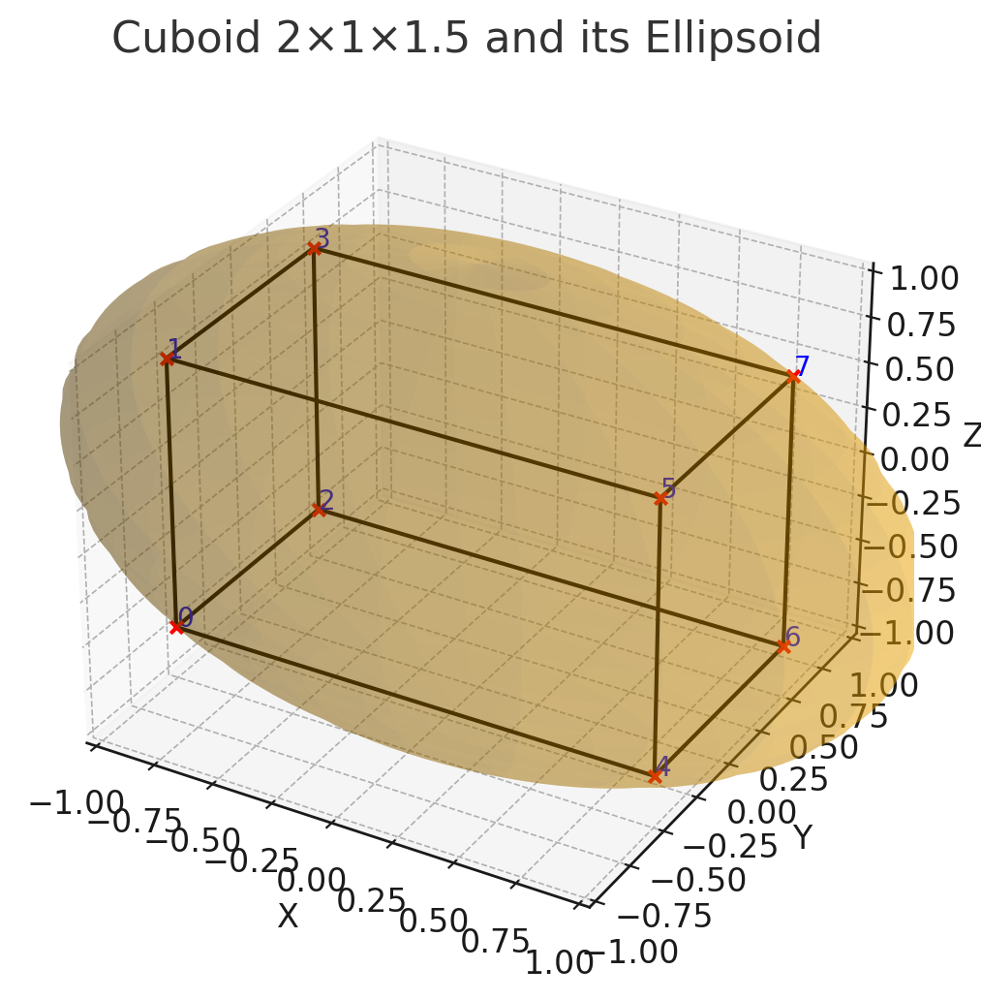

# Cuboid & Circumscribing Ellipsoid Plotter

This repository provides a Python script to visualize an axis-aligned cuboid and its minimal-volume circumscribing ellipsoid in 3D. Optionally, each cuboid vertex can be annotated with its index.

---

## Table of Contents

* [Overview](#overview)
* [Mathematical Derivation](#mathematical-derivation)

  * [1. Cuboid Vertices](#1-cuboid-vertices)
  * [2. Ellipsoid Equation](#2-ellipsoid-equation)
  * [3. Constraint from "Touching" Vertices](#3-constraint-from-touching-vertices)
  * [4. Minimizing Volume via Lagrange Multipliers](#4-minimizing-volume-via-lagrange-multipliers)
  * [5. Final Semi‑Axes Lengths](#5-final-semi%E2%80%90axes-lengths)
* [Code Structure](#code-structure)

  1. [Imports](#1-imports)
  2. [Function Definition](#2-function-definition)
  3. [Half‑Dimension Computation](#3-half%E2%80%90dimension-computation)
  4. [Corner Generation](#4-corner-generation)
  5. [Edge Connectivity](#5-edge-connectivity)
  6. [Ellipsoid Radii Calculation](#6-ellipsoid-radii-calculation)
  7. [Plot Setup](#7-plot-setup)
  8. [Drawing the Cuboid](#8-drawing-the-cuboid)
  9. [Annotating Vertices](#9-annotating-vertices)
  10. [Ellipsoid Surface Plotting](#10-ellipsoid-surface-plotting)
  11. [Equal Aspect Ratio](#11-equal-aspect-ratio)
  12. [Labels & Title](#12-labels--title)
* [Usage](#usage)
* [Example](#example)
* [License](#license)

---

## Overview

Given a cuboid of dimensions $a\times b\times c$ centered at the origin, we compute and plot the unique minimal‑volume axis-aligned ellipsoid that passes through all eight vertices of the cuboid.  When the cuboid is a cube $(a=b=c)$, this ellipsoid reduces to a sphere of radius half the cube’s space diagonal.

## Mathematical Derivation

### 1. Cuboid Vertices

An axis-aligned cuboid centered at the origin with side lengths $a,b,c$ has half‑dimensions:

$$
  h_x=\frac{a}{2},\quad h_y=\frac{b}{2},\quad h_z=\frac{c}{2}.
$$

Its 8 vertices are all combinations of signs:

$$
  (\pm h_x,\,\pm h_y,\,\pm h_z).
$$

### 2. Ellipsoid Equation

A centered ellipsoid with semi‑axes $r_x,r_y,r_z$ along $x,y,z$ satisfies:

$$
  \frac{x^2}{r_x^2} + \frac{y^2}{r_y^2} + \frac{z^2}{r_z^2} = 1.
$$

### 3. Constraint from "Touching" Vertices

Each vertex $(h_x,h_y,h_z)$ must lie on the ellipsoid:

$$
  \frac{h_x^2}{r_x^2} + \frac{h_y^2}{r_y^2} + \frac{h_z^2}{r_z^2} = 1
  \quad\Longrightarrow\quad
  \frac{a^2}{4r_x^2} + \frac{b^2}{4r_y^2} + \frac{c^2}{4r_z^2} = 1.
$$

Define the constraint function:

$$
  g(r_x,r_y,r_z) = \frac{a^2}{4r_x^2} + \frac{b^2}{4r_y^2} + \frac{c^2}{4r_z^2} - 1 = 0.
$$

### 4. Minimizing Volume via Lagrange Multipliers

The volume of the ellipsoid is

$$
  V = \frac{4}{3}\pi\,r_x\,r_y\,r_z.
$$

To minimize $V$ under $g=0$, we equivalently minimize $\ln V = \ln r_x + \ln r_y + \ln r_z + \text{const.}$.  Set up the Lagrangian:

$$
  \mathcal{L} = (\ln r_x + \ln r_y + \ln r_z) - \mu\,g(r_x,r_y,r_z).
$$

Compute partial derivatives:

1. For $r_x$:

$$
  \frac{\partial\mathcal{L}}{\partial r_x} = \frac{1}{r_x}
    + \mu \cdot \frac{a^2}{2\,r_x^3} = 0
  \quad\Longrightarrow\quad
  \mu = -\frac{2\,r_x^2}{a^2}.
$$

2. By symmetry:

$$
  \mu = -\frac{2\,r_y^2}{b^2},
  \quad
  \mu = -\frac{2\,r_z^2}{c^2}.
$$

Equate these to get

$$
  \frac{r_x^2}{a^2} = \frac{r_y^2}{b^2} = \frac{r_z^2}{c^2} = k^2.
$$

Hence

$$
  r_x = ka,\quad r_y = kb,\quad r_z = kc.
$$

### 5. Final Semi‑Axes Lengths

Plugging into the constraint:

$$
  \frac{a^2}{4(ka)^2} + \frac{b^2}{4(kb)^2} + \frac{c^2}{4(kc)^2} = \frac{3}{4k^2} = 1
  \quad\Longrightarrow\quad k = \frac{\sqrt3}{2}.
$$

Thus the minimal ellipsoid has:

$$
  r_x = \frac{\sqrt3}{2}\,a,\quad
  r_y = \frac{\sqrt3}{2}\,b,\quad
  r_z = \frac{\sqrt3}{2}\,c.
$$

---

## Code Structure

Below is a breakdown of `plot_cuboid_and_ellipsoid` in `plot_cuboid_ellipsoid_with_labels.py`:

1. **Imports**

   ```python
   import numpy as np
   import matplotlib.pyplot as plt
   from mpl_toolkits.mplot3d import Axes3D
   ```

2. **Function Definition**

   ```python
   def plot_cuboid_and_ellipsoid(a, b, c, annotate_vertices=False):
       """
       Plots a centered cuboid of size a×b×c and its minimal-volume
       circumscribing ellipsoid. If annotate_vertices=True, labels each corner.
       """
   ```

3. **Half‑Dimension Computation**

   ```python
   hx, hy, hz = a/2, b/2, c/2
   ```

4. **Corner Generation**

   ```python
   corners = np.array([
       (sx*hx, sy*hy, sz*hz)
       for sx in (-1, 1) for sy in (-1, 1) for sz in (-1, 1)
   ])
   ```

   * Creates an 8×3 array of all sign combinations.

5. **Edge Connectivity**

   ```python
   edges = [ (0,1),(0,2),(0,4),...,(6,7) ]
   ```

   * Each tuple indexes two vertices to draw an edge.

6. **Ellipsoid Radii Calculation**

   ```python
   k = np.sqrt(3)/2
   rx, ry, rz = k*a, k*b, k*c
   ```

   * From the Lagrange multiplier result.

7. **Plot Setup**

   ```python
   fig = plt.figure()
   ax  = fig.add_subplot(111, projection='3d')
   ```

8. **Drawing the Cuboid**

   ```python
   for i,j in edges:
       xs, ys, zs = zip(corners[i], corners[j])
       ax.plot(xs, ys, zs, color='black', linewidth=1.5)
   ```

9. **Annotating Vertices**

   ```python
   if annotate_vertices:
       for idx,(x0,y0,z0) in enumerate(corners):
           ax.scatter(x0,y0,z0, color='red', s=20)
           ax.text(x0,y0,z0, str(idx), color='blue', fontsize=10)
   ```

10. **Ellipsoid Surface Plotting**

    ```python
    u = np.linspace(0,2*np.pi,80)
    v = np.linspace(0,np.pi,80)
    U,V = np.meshgrid(u,v)
    X_e = rx*np.sin(V)*np.cos(U)
    Y_e = ry*np.sin(V)*np.sin(U)
    Z_e = rz*np.cos(V)
    ax.plot_surface(X_e,Y_e,Z_e, alpha=0.3, rstride=4, cstride=4)
    ```

11. **Equal Aspect Ratio**

    ```python
    max_range = max(a,b,c)
    for setter in (ax.set_xlim, ax.set_ylim, ax.set_zlim):
        setter(-max_range/2, max_range/2)
    ```

    * Ensures no axis distortion.

12. **Labels & Title**

    ```python
    ax.set_xlabel('X'); ax.set_ylabel('Y'); ax.set_zlabel('Z')
    ax.set_title(f'Cuboid {a}×{b}×{c} and its Circumscribing Ellipsoid')
    ```

---

## Usage

1. Clone the repository:

   ```bash
   git clone <repo_url>
   cd <repo_folder>
   ```
2. Install dependencies (e.g. via pip):

   ```bash
   pip install numpy matplotlib
   ```
3. Run the script:

   ```bash
   python plot_cuboid_ellipsoid_with_labels.py
   ```
4. To show vertex indices, set `annotate_vertices=True` in the example call.

---

## Example


---

## License

MIT License

> *© 2025 Yug Desai*
